# Elastic Cloud Compute (EC2)

EC2 is one of the most widely used IaaS product within AWS that allows users to rent resizable virtual machines (instances) to run applications. These are private service by default, uses VPC networking and AZ resilient (Instance fails if AZ fails). EC2 can use Local on-host storage or Elastic Block Store (EBS). Instance type, size capabilities can be selected and billed per second. CPU, memory, disk and networking, all four are billed when running. Only disk storage is billed when stopped (EBS).

Instance Life cycle: Running --> Stopped --> Terminated

```mermaid
architecture-beta
    group vpc(logos:aws-vpc)[Virtual Private Cloud]
        service ec2(logos:aws-ec2)[EC2 Host] in vpc
        service disk1(disk)[EBS Volume] in vpc
        service disk2(database)[Instance Volume] in vpc
        service ec2I(logos:aws-ec2)[EC2 Instance] in vpc
        service sg(logos:aws-securitygroup)[Security Group ENI] in vpc
        service cw(logos:aws-cloudwatch)[Cloud Watch] in vpc

      ec2:R <--> L:ec2I
      ec2I:T <--> B:disk2
      ec2:R <--> L:disk2
      disk1:L <--> R:ec2I
      ec2I:B <--> T:sg
      ec2I:B <--> T:cw
        
```



Key features include:

<details>
<summary>Instance Types: Various configurations of CPU, memory, storage, and networking to suit different workloads. Instances are grouped into families, which are designed for a specific broad type workload.</summary>

- General Purpose: Balanced compute, memory, and networking—ideal for web servers, dev/test environments, and small databases.
  - T series: Burstable performance instances for low to moderate baseline performance with the ability to burst. eg: t3.micro, t4g.small, t2.medium.
  - M series: Balanced instances for a variety of workloads.
  - A series: Cost-effective instances powered by ARM-based processors.
- Compute Optimized: High-performance CPUs for compute-bound tasks like batch processing and gaming.
  - C Series for High CPU-to-memory ratio: c6i.xlarge, c7g.large
- Memory Optimized: High memory for in-memory databases, analytics, and caching workloads.
  - R Series for Balanced memory: r6i.2xlarge, r7g.large
  - X Series for Extreme memory: x2idn.16xlarge
  - Z Series for High memory and compute: z1d.large
  - U Series for Bare metal, ultra memory: u-6tb1.metal
- Storage Optimized: High disk throughput and IOPS—ideal for NoSQL databases and big data.
  - I Series High IOPS SSD: i4i.large, i3en.24xlarge
  - D Series Dense HDD storage: d3en.8xlarge
  - H Series High throughput HDD: h1.8xlarge
- Accelerated Computing: Include GPUs or FPGAs for ML, video rendering, and scientific simulations
  - P Series GPU for ML training. eg: p4d.24xlarge, p3.2xlarge
  - G Series GPU for graphics/ML inference. eg: g5.xlarge, g4dn.2xlarge
  -F Series FPGA-based. eg: fp1.1.2xlarge
  - Inf Series Inferentia chip for ML inference. eg: inf1.xlarge
  - Trn Series Trainium chip for high performance FL training and generative AI workloads (LLM and diffusion models). eg: trn1.32xlarge

</details>

<details>
<summary>Instance Sizes: Different sizes within each instance type to provide varying levels of resources.</summary>

- Nano,
- Small,
- Medium,
- Large,
- X.Large,
- 2X.Large and
- Larger

</details>

<details>
<summary>Elastic Block Store (EBS): Persistent block storage volumes that can be attached to EC2 instances, based on four underlying storage types. Volume are replicated within a single AZ. EBS supports a maximum per-instance throughput of 1750 MiB/s and 80,000 IOPS.</summary  >

- General Purpose SSD (gp3, gp2) [Default] for balanced price and performance, 3 IOPS/GB (100 IOPS - 16,000 IOPS) Burst up to 3,000 IOPS (credit based). Volume Size of 1 GiB - 16 TB size, max throughput p/vol of 250 MB/s
- Provisioned IOPS SSD (io2, io1) for application that require sustained IOPS performance like large database workloads. 4 GB - 16TB, max throughput of 1000 MB/s
- Throughput Optimized HDD (st1) Low cost HDD designed for frequently accessed, cannot be boot volume, throughput-intensive workloads. 500 GB - 16 TB, max throughput of 500 MB/s and IOPS 500
- Cold HDD (sc1) Lowest cost HDD designed for less frequently accessed data, cannot be a boot volume. 500 GB - 16 TB, max throughput of 250 MB/s and IOPS 250

EBS Snapshots are a point-in-time backup of an EBS volume stored in S3. The initial snapshot is a full copy of the volume. Future snapshots only store the data changed since the last snapshot.

Snapshots can be used to create new volumes and are a great way to move or copy instances between AZs. When creating a snapshot of the root/boot volume of an instance of busy volume, it’s recommended the instance is powered off, or disks are “flushed”

Snapshots can be copied between regions, shared and automated using Data Lifecycle Manager (DLM).

</details>

<details>
<summary>Amazon Machine Images (AMIs): Pre-configured templates for building & launching instances, including OS, application server, and applications.</summary>

An EC2 instance can be created from an AMI, or an EC2 can be used to create an AMI. AMIs store snapshots of EBS (boot) volumes, permissions, and a block device mapping, which configures how the instance OS see the attached volumes. AMIs can be shared, free or paid and can be copied to other AWS regions.

Types of AMIs

Instance Store Back AMIs - Root volume doesn’t use EBS
EBS Backed AMIs - Root volume uses EBS
Process of Creating AMI

Configure Instance - Source instance and attached EBS volumes are configured with any required software and configuration.

Create Image - Snapshots are created from volumes. AMI references snapshots, permission, and block device mapping.

Launch Instance - With appropriate launch permissions, instances can be created from an AMI. EBS volumes are created using snapshots as the source, and an EC2 instance is created using the block device mapping to reference its new volumes.

AMI’s can be used to build servers with complex configuration.

- AWS provided (Amazon Linux, Windows, Ubuntu, Red Hat, SUSE)
- Marketplace (Third-party software)
- Custom (Created by users to include specific configurations and software)

```admonish warning
Downside of using AMI is you can’t do dynamic configuration
```

Bootstrapping is a process where instructions are executed on an instance during its launch process. Bootstrapping is used to configure the instance, perform software installation, and add application configuration.

In EC2, user data can be used to run shell scripts or run cloud-init directives.

Bootstrap vs AMI: With AMI’s you can reduce time it takes to install and configure versus with bootstrap you can use shell commands to perform dynamic configuration.

</details>

<details>
<summary>Instance Metadata: Data about your instance that you can use to configure or manage the running instance.</summary>

Instance metadata is data about your instance that you can use to configure or manage the running instance. You can access your instance metadata from within your instance using a special URL: ```http://169.254.169.254/latest/meta-data/```

Instance metadata is a way that scripts and application running on EC2 can get visibility of data they would normally need API calls for.

The metadata can provide the current external IPv4 address for the instance, which isn’t configured on the instance itself but provided by the internet gateway in the VPC. It provides the Availability Zone the instance was launched in and the security group applied to the instance. IN the case of spot instances, it also provides the approximate time the instance will terminate.

EC2 instance roles are IAM roles that can be “assumed” by EC2 using an intermediary called an instance profile. An instance profile is either created automatically when using the console UI or manually when using the CLI. It’s a container for the role that is associated with an EC2 instance.

The instance profile allows application on the EC2 instance to access the credentials from the role using the instance metadata.

</details>

<details>
<summary>Security Groups: Virtual firewalls that control inbound and outbound traffic to instances.
</summary>

Security Groups are software firewalls that can be attached to network interface and (by association) products in AWS. Security groups each have inbound rules and outbound rules. A rule allows traffic to and from a source (IP, network, named AWS entity) and protocol. Security Group belongs to a VPC.

Each Elastic Network Interface (ENI) can have up to 5 security groups.

They are stateful - meaning for any traffic allowed in/out, the return traffic is automatically allowed. Security groups can reference AWS resource, other security groups, and even themselves.

**Key Pairs**: Secure login information for instances using SSH keys.

```admonish warning

warning: Remember to regularly review and update your security groups and key pairs to maintain the security of your EC2 instances.
```

</details>

<details>
<summary>Instance IP</summary>

- Private Instance - Private IP allocated when launching instances. Unchanged during stop/start. Released when terminated.
- Public Instance - Same private address as private instance. A public IPv4 address is allocated when the machine starts and deallocated when it stops. By default all public IPv4 addresses are dynamic
- Elastic IP - Static IPv4 address  for dynamic cloud computing. They allow you to mask the failure of an instance or software by remapping the address to another instance in your account. You can have up to 5 per region. There is a small hourly charge for unused Elastic IPs to encourage efficient use.  

</details>

**Pricing Models**: Options include On-Demand, Reserved, Spot Instances, and Savings Plans to optimize costs based on usage patterns.

## Connecting to EC2

EC2 instances can run different OS’s
Windows: RDP - Remote Desktop Protocol
Protocol Port 3389
Linux: SSH protocol
Port 22

**Auto Scaling**: Automatically adjusts the number of instances based on demand to maintain performance and control costs.

**Elastic Load Balancing (ELB)**: Distributes incoming application traffic across multiple instances for fault tolerance and high availability.

```admonish tip
    warning: Remember to regularly review and update your security groups and key pairs to maintain the security of your EC2 instances.
```
