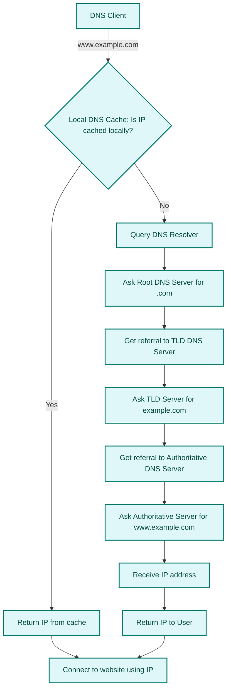
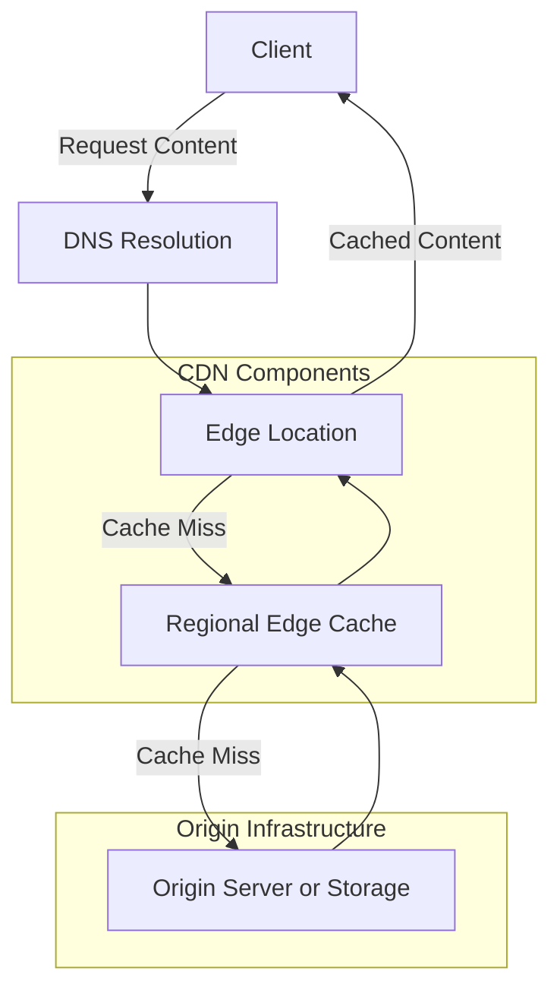

# Cloud Services

## Storage

File storage, block storage, and object storage are three distinct methods of storing data, each with unique characteristics and use cases.

<!-- ANCHOR: object_storage -->
### Object Storage

Object storage manages any type of data as discrete units called objects, which include the data itself, metadata, and a unique identifier. Objects are stored in a flat structure without a hierarchical organization.

Use Cases: Best suited for large volumes of unstructured data, such as backups, media storage, and big data analytics. It is also widely used for static website hosting. It is commonly used in cloud environments due to its scalability and accessibility.

Advantages: High scalability, ability to manage large datasets, and support for custom metadata. It is ideal for applications that require flexible data management and long-term data retention.

<!-- ANCHOR_END: object_storage -->

<!-- ANCHOR: block_storage -->
### Block Storage

Block storage divides data into fixed-size blocks, each with a unique identifier. These blocks are usually managed as persistent block storage for compute instance server operating system and can be accessed independently.

Use Cases: Commonly used in high-performance applications like databases, virtual machines, and enterprise applications for transactional workloads that require fast read/write operations.

Advantages: High performance, low latency, and scalability. It allows for precise control over data management and is suitable for transactional workloads

<!-- ANCHOR_END: block_storage -->

<!-- ANCHOR: file_storage -->
### File Storage

File storage organizes data in a hierarchical structure, similar to a traditional file system on a computer. Data is stored in files and folders, making it easy to navigate and manage. Usually have support for network-attached storage (NAS) for applications requiring a file system interface and shared file access.

Use Cases: Ideal for shared file systems, content management, and applications where multiple users need access to files, such as document storage and collaboration tools.

Advantages: User-friendly interface, easy to manage and retrieve files, and suitable for smaller datasets.

<!-- ANCHOR_END: file_storage -->

## Compute

### Server-based Compute

### Serverless Compute

## Databases

## Network

### Virtual Networks

### Load Balancers

<!-- ANCHOR: dns -->

### Domain Name System (DNS)

DNS is a **discovery service** based on hierarchial, distributed database that translates human-readable domain names such as [amazon.com](http://amazon.com) to IP address 104.98.34.131 (process called name resolution).

The global DNS system is anchored by 13 root servers (labeled A through M), which are the top-level authorities in the DNS hierarchy. These servers are not owned by a single entity, but are operated by 12 independent organizations such as Verisign (operates A and J), University of Maryland, NASA, ICANN, Internet Systems Consortium (ISC), US Department of Defense, and others. Each root server is actually a cluster of servers using **anycast routing**, meaning there are hundreds of physical servers worldwide responding to root DNS queries. These root servers are critical infrastructure for the internet that ensures global consistency and resilience in domain resolution.

DNS is organized in a tree-like hierarchy:

1. Root Level: Represented by a dot (.), managed by 13 root servers. Top level Root servers direct queries to TLD servers
2. Top-Level Domains (TLDs): Like .com, .org, .net, .edu, etc. TLD servers direct queries to authoritative servers for specific domains.
3. Second-Level Domains: Like example in example.com. Handle by the authoritative DNS server that holds the actual DNS records (A, CNAME, ...)
4. Subdomains: Like www in "www.example.com", "api.example.com" for difference services, "dev.example.com" for different environment. Handled through delegation or additional DNS records within the authoritative DNS zone of a domain.

Common DNS Record Types

| Record Type | Purpose | Example |
|-------------|---------|---------|
| **A (Address)** | Maps a domain to an IPv4 address | `example.com → 192.0.2.1` |
| **AAAA** | Maps a domain to an IPv6 address | `example.com → 2001:db8::1` |
| **CNAME (Canonical Name)** | Points a domain to another domain name | `www.example.com → example.com` |
| **MX (Mail Exchange)** | Directs email to mail servers for the domain | `example.com → mail.example.com (priority 10)` |
| **TXT (Text)** | Stores arbitrary text—often used for verification of ownership or email legitimacy or SPF records | `example.com → "v=spf1 include:_spf.google.com ~all"` |
| **TTL (Time to Live)** | value configured by Auth server admin to store query at the resolver for certain time| |
| **NS (Name Server)** | Specifies authoritative DNS servers for the domain for delegation | `example.com → ns1.dnsprovider.com` |
| **PTR (Pointer)** | Used for reverse DNS lookups (IP → domain) | `192.0.2.1 → example.com` |
| **SRV (Service)** | Defines location of services (e.g., SIP, LDAP) | `_sip._tcp.example.com → sipserver.example.com:5060` |
| **SOA (Start of Authority)** | Contains metadata about the domain zone | Includes admin email, serial number, refresh rate |

DNS responses are cached at multiple levels (browser, OS, ISP, resolver) to reduce lookup time and network traffic.
Each record has a Time to Live (TTL) value that determines how long it can be cached.

Recursive Query: A DNS resolver takes full responsibility for resolving a domain name, querying other servers as needed.
Iterative Query: A DNS server responds with the best answer it has or refers the client to another server.

- **DNS Client:** Your laptop, phone, tablet, PC, etc.
- **Resolver:** Software on your device, or a server which queries DNS on your behalf
- **Zone:** A part of the DNS database (e.g. amazon.com)
- **Zonefile:** Physical database for a zone
- **Nameserver:** Where zonefiles are hosted

Root **Hints** are a predefined list of IP addresses and hostnames of the 13 DNS root servers that a DNS resolver uses to begin the process of resolving domain names.

Root Zone is operated by IANA - Internet Assigned Numbers Authority

Root Server: Hosts the DNS root zone
Root zone: Point at TLD authoritative servers
gTLD: generic Top Level Domain (.com .org etc)
ccTLD: country-code Top Level Domain (.uk, .eu, etc)

Traditional DNS is not secure as it doesn’t verify the authenticity of responses. Attackers can forge DNS replies and redirect users to malicious sites. DNSSEC (Domain Name System Security Extensions) adds cryptographic signatures to DNS data to prevent spoofing and ensure authenticity. DNSSEC builds a trust chain from the root zone down to your domain. Roots DNS servers and TLDs Servers support DNSSEC while its optional in domain registrars, authoritative DNS providers and Resolvers (ISP, browsers).

Each DNS zone (e.g., example.com) has a private key used to sign DNS records. The corresponding public key is published in the DNS as a DNSKEY record. When a resolver receives a DNSSEC-enabled response, it checks the RRSIG (Resource Record Signature) against the DNSKEY. If the signature matches, the data is trusted otherwise response is rejected.

Registry : Organization that maintains the zones for a TLD
Registrar: Organization with relationship with .org TLD zone manager allowing domain registration

A hosted zone is a container for DNS records in a domain, managed by a DNS service like AWS Route 53, Google Cloud DNS, or Azure DNS. It defines how traffic is routed for a domain and its subdomains.

<!-- ANCHOR_END: dns -->

### Network Security

### Network Monitoring

<!-- ANCHOR: cdn -->

### CDN (Content Delivery Network)

CDN accelerates content delivery globally with CDN servers in edge locations to minimize latency, higher transfer speed and Reduced Load on Content Server.
Common CDNs: Microsoft CDN, Akamai CDN, Verizon CDN, AWS CloudFront, Google Cloud CDN, Cloudflare

SSL/TLS encryption and DDoS protection are usually standard across all platforms. Custom caching rules and Geo-restriction and access control are also common.

Components of CDN Architecture

- Origin - The Server or service that hosts your content. Can be cloud-native (S2, Blob, storage) or external on-prem servers
- Distribution/Endpoint Profile/Backend Service - The “configuration” entity with the CDN service that define CDN behaviors
- Edge Location - The local infrastructure that hosts caches of your data close to the users
- Intermediate (Regional Edge) Caches - Large versions of edge locations between edge and origin to reduce origin fetches.

<!-- ANCHOR_END: cdn -->
